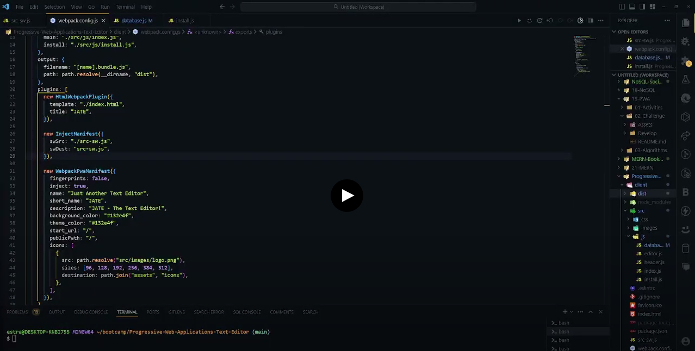
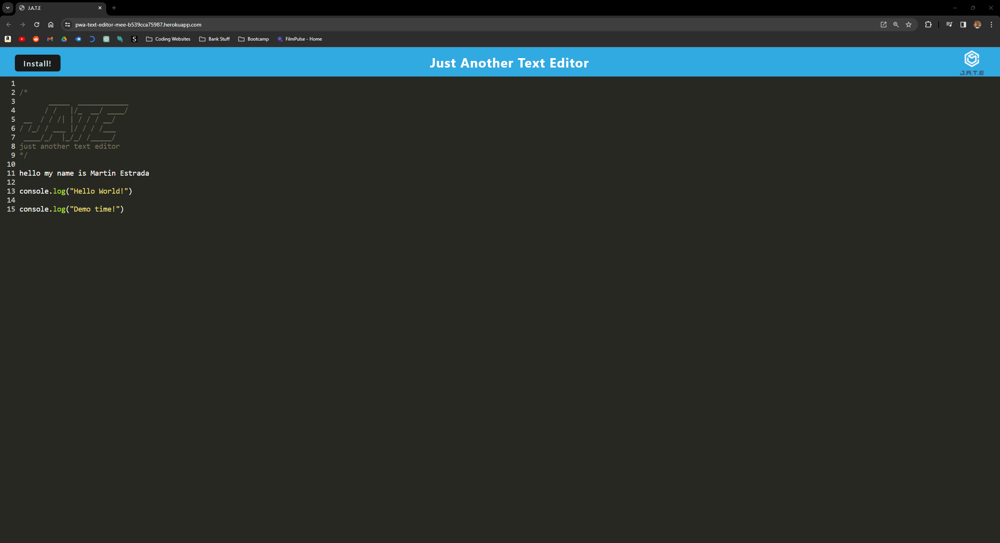

# Progressive-Web-Applications-Text-Editor

## Description
JATE (Just Another Text Editor) is a powerful yet simple text editor designed to run in your web browser. It leverages Progressive Web Application (PWA) features, allowing you to create, edit, and store notes or code snippets seamlessly, with or without an internet connection.

## User Story

```md
AS A developer
I WANT to create notes or code snippets with or without an internet connection
SO THAT I can reliably retrieve them for later use
```

## Acceptance Criteria

```md
GIVEN a text editor web application
WHEN I open my application in my editor
THEN I should see a client server folder structure
WHEN I run `npm run start` from the root directory
THEN I find that my application should start up the backend and serve the client
WHEN I run the text editor application from my terminal
THEN I find that my JavaScript files have been bundled using webpack
WHEN I run my webpack plugins
THEN I find that I have a generated HTML file, service worker, and a manifest file
WHEN I use next-gen JavaScript in my application
THEN I find that the text editor still functions in the browser without errors
WHEN I open the text editor
THEN I find that IndexedDB has immediately created a database storage
WHEN I enter content and subsequently click off of the DOM window
THEN I find that the content in the text editor has been saved with IndexedDB
WHEN I reopen the text editor after closing it
THEN I find that the content in the text editor has been retrieved from our IndexedDB
WHEN I click on the Install button
THEN I download my web application as an icon on my desktop
WHEN I load my web application
THEN I should have a registered service worker using workbox
WHEN I register a service worker
THEN I should have my static assets pre cached upon loading along with subsequent pages and static assets
WHEN I deploy to Heroku
THEN I should have proper build scripts for a webpack application
```

## Link to Google Drive

The following video shows an example of the application being used:

[](https://drive.google.com/file/d/1HtmovRfjlgtXL_7OdekZmclQoAccs0lg/view?usp=sharing)

## Screenshot

The following image shows the Progressive Web Application's appearance and functionality with a live webpage link for you to check out!:



## Table of Contents
- [Description](#description)
- [User Story](#user-story)
- [Acceptance Criteria](#acceptance-criteria)
- [Link to Google Drive](#link-to-google-drive)
- [Screenshot](#screenshot)
- [Installation](#installation)
- [Usage](#usage)
- [License](#license)
- [Questions](#questions)

## Installation
No installation is needed.

## Usage
1. Open the text editor.
2. Create and edit your content.
3. Save your content with confidence, even offline.
4. Install the app for quick access.

## License
[](https://opensource.org/licenses) This project is licensed under the MIT License.

## Questions
If you have any questions or encounter any issues, please feel free to [open an issue](https://github.com/mxrtinee/Progressive-Web-Applications-Text-Editor/issues) or contact me directly:<br>
GitHub: [Mxrtinee](https://github.com/Mxrtinee)<br>
Email: [hello@martinestrada.dev](mailto:hello@martinestrada.dev)